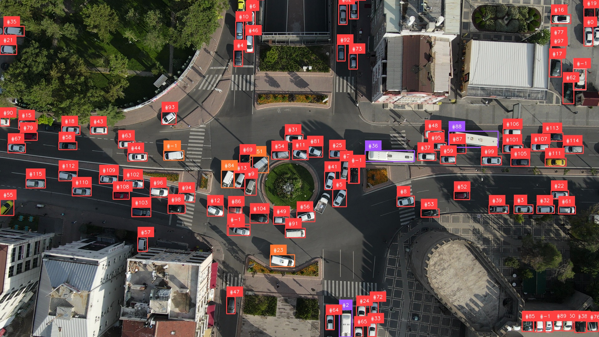
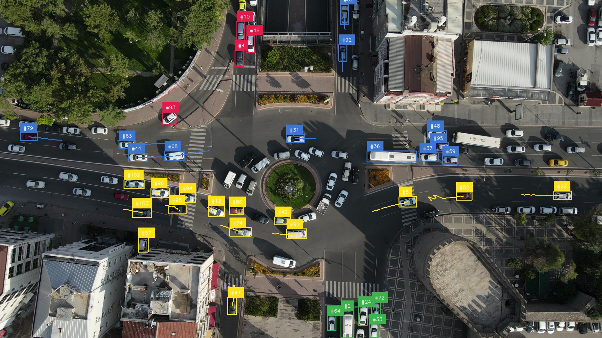
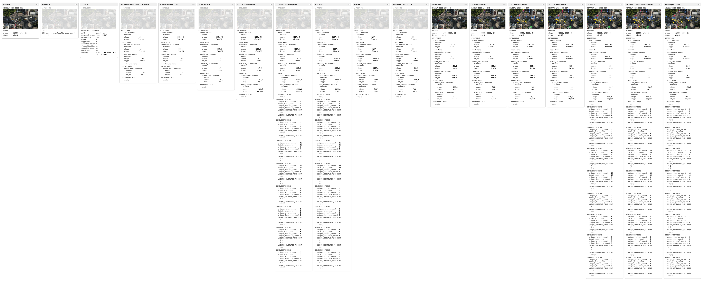

# Track Zone Visits

`TrackZoneVisits` records the ordered sequence of zones that each tracked
detection enters. Unlike a zone filter, it preserves that history as
`zone_visits` on the detection, so downstream stages can reason about a path
such as entrance → aisle → checkout.

This tutorial applies the capability to cars travelling through an
intersection.

<iframe
  src="https://drive.google.com/file/d/1qadBd7lgpediafCpL_yedGjQPk-FLK-W/preview"
  width="100%"
  height="540"
  allow="autoplay"
  allowfullscreen>
</iframe>

## Run Detection

Run the traffic-specific YOLO model on each frame and convert its result to
Supervision `Detections`. The resulting detection stream is the input to the
vehicle-tracking stage added next.

```python
import supervision as sv

from ml_pipes.core import Pipeline
from ml_pipes.standard import Select, Store
from ml_pipes.supervision import Detections
from ml_pipes.ultralytics import yolo

pipeline = Pipeline(
    [
        Store("source_frame"),
        yolo.Predict(model=model_path, conf=0.3, iou=0.7),
        Select(0),
        Detections.FromUltralytics(),
    ],
    auto_validate=True,
)
```

## Track Vehicles

The traffic model defines bus, car, truck, and van as classes `0` through `3`.
Filter to those classes before adding `ByteTrack`. It assigns a persistent ID
to each vehicle so subsequent stages can associate its positions and zone
visits across frames. Restore the source frame after tracking, then draw a box
and persistent ID for every tracked vehicle. This establishes the baseline
view before applying zone-based filtering or coloring.

```{ .py hl_lines="18-22" }
import numpy as np

from ml_pipes.standard import Recall
from ml_pipes.supervision import BoxAnnotator, LabelAnnotator
from ml_pipes.supervision.trackers import ByteTrack


def keep_vehicle_detections(detections: sv.Detections) -> np.ndarray:
    return np.isin(detections.class_id, (0, 1, 2, 3))


pipeline = Pipeline(
    [
        Store("source_frame"),
        yolo.Predict(model=model_path, conf=0.3, iou=0.7),
        Select(0),
        Detections.FromUltralytics(),
        Detections.Filter(keep_vehicle_detections),
        ByteTrack(),
        Recall("source_frame", prepend=True),
        BoxAnnotator(),
        LabelAnnotator(show_tracker_id=True),
    ],
    auto_validate=True,
)
```

This later frame shows every vehicle that the tracker has associated, whether
or not it has reached a configured traffic zone.



## Track Zone Visits

Track cars from an entry approach to an exit approach. Define the four entry
and four exit polygons, then give their IDs to `TrackZoneVisits`. It begins a
history only when a vehicle enters through a configured entry zone and stops it
when the vehicle reaches an exit. This excludes vehicles that were already in
the intersection when the video began.

Retain only vehicles with that history, then color their boxes, labels, and
traces using the entry zone. Drawing traces last leaves the current vehicle
position and its ID clear above the historical path.

```{ .py hl_lines="9 12-14 24-44" }
from examples.run_traffic_analysis import (
    COLORS,
    ENTRY_ZONE_IDS,
    EXIT_ZONE_IDS,
    TRAFFIC_ZONE_POLYGONS,
    TrackZoneVisits,
    has_zone_visits,
)
from ml_pipes.supervision import Detection, TraceAnnotator


def zone_visit_color_lookup(detection: Detection) -> int:
    """Use the entry zone as the display color."""
    return int(detection.data["zone_visits"][0])

pipeline = Pipeline(
    [
        Store("source_frame"),
        yolo.Predict(model=model_path, conf=0.3, iou=0.7),
        Select(0),
        Detections.FromUltralytics(),
        Detections.Filter(keep_vehicle_detections),
        ByteTrack(),
        TrackZoneVisits(
            TRAFFIC_ZONE_POLYGONS,
            start_zone_ids=ENTRY_ZONE_IDS,
            end_zone_ids=EXIT_ZONE_IDS,
        ),
        Detections.Filter(has_zone_visits),
        Recall("source_frame", prepend=True),
        BoxAnnotator(
            color=COLORS,
            custom_color_lookup=zone_visit_color_lookup,
        ),
        LabelAnnotator(
            show_tracker_id=True,
            color=COLORS,
            custom_color_lookup=zone_visit_color_lookup,
        ),
        TraceAnnotator(
            thickness=2,
            color=COLORS,
            custom_color_lookup=zone_visit_color_lookup,
        ),
    ],
    auto_validate=True,
)
```

At the same point in the video, vehicles outside the configured entry-to-exit
flow are removed. The remaining vehicles are colored by their starting zone,
making the visit history visible before aggregate metrics are drawn.



## Analyze Zone Transitions

`ZoneVisitAnalytics` consumes the per-vehicle histories before the annotation
branch. It publishes an aggregate metrics snapshot for every zone: unique
visitors, total visits, unique arrivals and departures, and directed origins
and destinations. Store that snapshot while it is paired with detections, then
restore it for `ZoneTransitionAnnotator` after the normal annotation stages.

`ZoneTransitionAnnotator` draws the zone boundaries and transition totals, and
returns the metrics unchanged. The final pipeline value therefore remains
available to a later reporting, export, or alerting stage.

```{ .py hl_lines="21-23 40-42" }
from examples.run_traffic_analysis import (
    ZoneTransitionAnnotator,
    ZoneVisitAnalytics,
)
from ml_pipes.standard import Pick
from ml_pipes.supervision import ImageWindow

pipeline = Pipeline(
    [
        Store("source_frame"),
        yolo.Predict(model=model_path, conf=0.3, iou=0.7),
        Select(0),
        Detections.FromUltralytics(),
        Detections.Filter(keep_vehicle_detections),
        ByteTrack(),
        TrackZoneVisits(
            TRAFFIC_ZONE_POLYGONS,
            start_zone_ids=ENTRY_ZONE_IDS,
            end_zone_ids=EXIT_ZONE_IDS,
        ),
        ZoneVisitAnalytics(zone_count=len(TRAFFIC_ZONE_POLYGONS)),
        Store("zone_visit_metrics", source=1),
        Pick(0),
        Detections.Filter(has_zone_visits),
        Recall("source_frame", prepend=True),
        BoxAnnotator(
            color=COLORS,
            custom_color_lookup=zone_visit_color_lookup,
        ),
        LabelAnnotator(
            show_tracker_id=True,
            color=COLORS,
            custom_color_lookup=zone_visit_color_lookup,
        ),
        TraceAnnotator(
            thickness=2,
            color=COLORS,
            custom_color_lookup=zone_visit_color_lookup,
        ),
        Recall("zone_visit_metrics"),
        ZoneTransitionAnnotator(TRAFFIC_ZONE_POLYGONS),
        ImageWindow("Traffic Zone Visit Analytics", at=0),
    ],
    auto_validate=True,
)
```

This later frame shows the completed intersection analysis: zone boundaries,
tracked vehicles, and the transition totals accumulated so far.


## Run the Pipeline

Use one pipeline instance for the complete video so that its tracker, visit
history, and metrics retain their state. `ImageWindow` displays the live
annotated frame. Its side effect does not change the pipeline value, which is
the `(annotated_frame, visited_detections, metrics_by_zone)` tuple. Select the
annotated frame at index `0` for `process_video`.

```python
sv.process_video(
    source_path=source_path,
    target_path="traffic-zone-visits.mp4",
    callback=lambda frame, _: pipeline(frame)[0],
)
```

The complete runnable version is available at
[`examples/run_traffic_analysis.py`](https://github.com/trained-by-humans/ml-pipes-supervision/blob/main/examples/run_traffic_analysis.py).

<video controls>
  <source src="../../assets/track_zone_visits/result.mp4" type="video/mp4">
</video>

## Pipeline Inspection

The first frame has no visit history, so warm the same stateful pipeline to a
representative later frame before inspecting it. `Pipeline.inspect()` records
every operator boundary while preserving the output produced by the pipeline.

```python
from ml_pipes.inspection import PipelineInspector

video_info = sv.VideoInfo.from_video_path(source_path)
frames = iter(sv.get_video_frames_generator(source_path))
for _ in range(video_info.total_frames // 2):
    pipeline(next(frames))

representative_frame = next(frames)
inspection = pipeline.inspect(representative_frame)
PipelineInspector().save(inspection, "inspection.html")
```

[](../assets/track_zone_visits/inspection.html)

*Click the image to open the interactive inspection report.*
